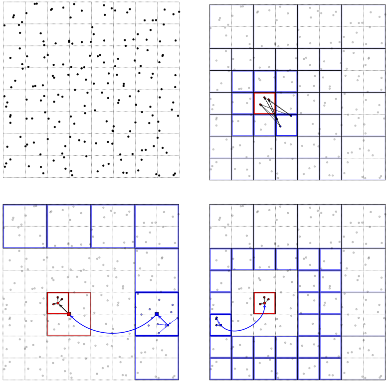

.. FMM3D documentation master file, created by
   sphinx-quickstart on Wed Nov  1 16:19:13 2017.
   You can adapt this file completely to your liking, but it should at least
   contain the root `toctree` directive.

Fast multipole methods in three dimensions (FMM3D)
==================================================

	    
`FMM3D <https://github.com/flatironinstitute/FMM3D>`_ 
is a set of libraries to compute N-body interactions 
governed by the Laplace and Helmholtz equations,
to a specified precision, in three dimensions,
on a multi-core shared-memory machine.
The library is written in Fortran,
and has wrappers for C, MATLAB, and Python.
As an example, given $M$ arbitrary points $y_j \in \mathbb{R}^{3}$ 
with corresponding real numbers $c_j$, and 
$N$ arbitrary points $x_{j} \in \mathbb{R}^{3}$, the Laplace FMM
evaluates the $N$ real numbers

.. math:: u_{\ell} = \sum_{j=1}^M \frac{c_j}{\| x_{\ell} - y_{j}\|} ~, 
   \qquad \mbox{ for } \; \ell=1,2,\ldots N ~.
   :label: lapcp

The $y_j$ can be interpreted as source locations, $c_j$
as charge strengths, and $u_{\ell}$ as the resulting potential at
target location $x_{\ell}$.

Such N-body interactions are needed in many applications in 
science and engineering, including molecular dynamics, astrophysics, 
rheology, and the numerical solution of partial differential equations.
The naive CPU effort to evaluate :eq:`lapcp` is $O(NM)$.
The FMM approximates :eq:`lapcp` to a requested relative precision
$\epsilon$ with linear effort $O((M+N) \log^{3/2} (1/\epsilon))$.

The FMM relies on compressing the interactions between well-separated 
clusters of source and target points at a hierarchy of scales using
analytic outgoing, incoming, and plane-wave 
expansions of the interaction kernel and associated translation
operators. 
This library is an improved version of the `FMMLIB3D <https://github.com/zgimbutas/fmmlib3d>`_
software, Copyright (C) 2010-2012: Leslie Greengard and Zydrunas Gimbutas, released under the 
BSD license. 
**We provide two implementations of the library - an easy to install
version with minimal dependencies, and a high-performance optimized
version (which on some CPUs is 3x faster than the "easy" version).** 
For detailed instructions, see installation.
The major improvements are the following:

-  The use of plane wave expansions for diagonalizing the outgoing to incoming translation operators
-  Vectorization of the FMM, to apply the same kernel with the same source and target locations to multiple 
   strength vectors
-  Optimized direct evaluation of the kernels using the `SCTL <https://github.com/dmalhotra/SCTL>`_ library
-  A redesign of the adaptive tree data structure

For sources and targets distributed in the volume, this code is about 4 times
faster than the previous generation on a single CPU core, and for
sources and targets distributed on a surface, this code is about 2 times
faster.  

.. note::
   
   The present version of the code does not
   incorporate high frequency versions of the FMM.
   The plane wave expansions are used throughout for the Laplace FMM and for the Helmholtz case
   in the low frequency regime (for box sizes up to 32 wavelengths). At higher frequencies,
   the Helmholtz FMM uses the same ``point and shoot`` translation operators as FMMLIB3D, which
   results in sub-optimal performance. 

.. note::

   For very small repeated problems (less than 1000 input and output points),
   users should also consider dense matrix-matrix multiplication using
   BLAS3 (eg DGEMM,ZGEMM).

   
.. toctree::
   :maxdepth: 2
	   
   install
   math
   fortran-c
   matlab
   python
   legacy
   ackn
   ref
   

   
